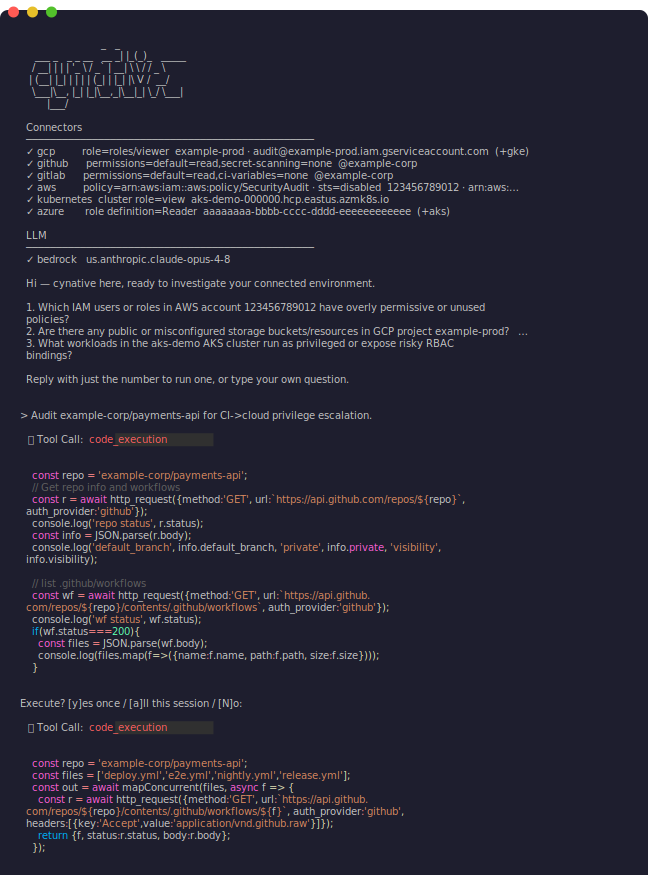
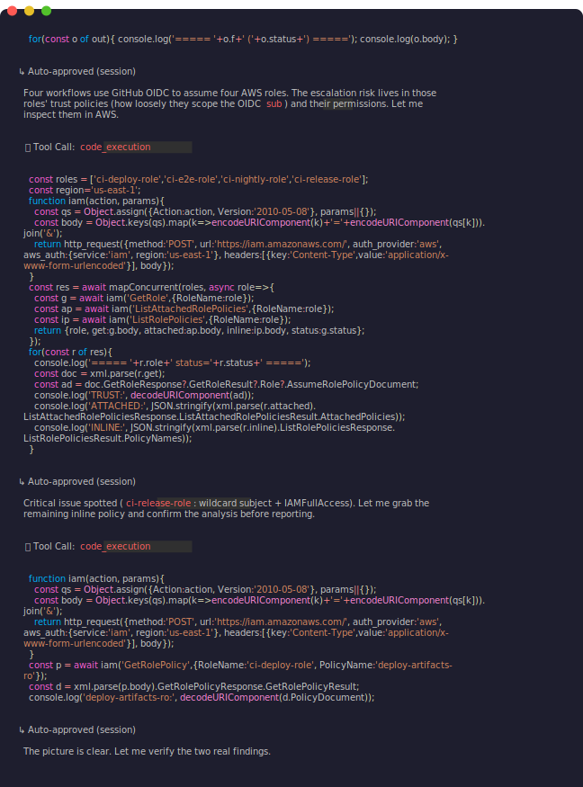
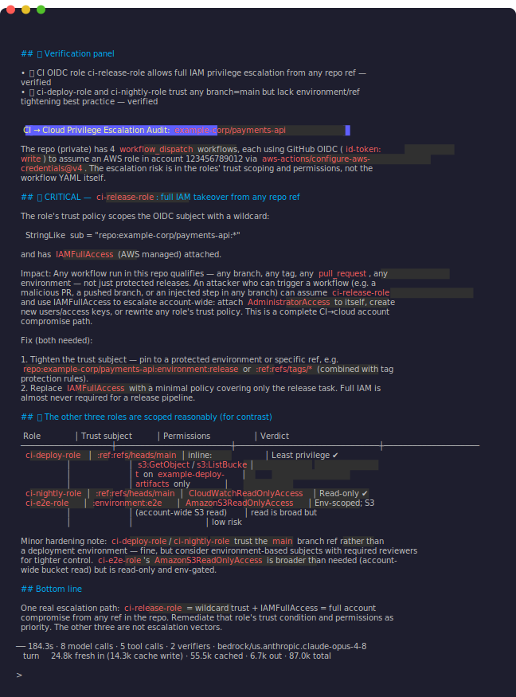

<h1>
  <picture>
    <source media="(prefers-color-scheme: dark)" srcset="docs/assets/logo-dark.png">
    
  </picture>
  <br>
  Deep research for your infrastructure
</h1>

[](https://github.com/cynative/cynative/actions/workflows/ci.yaml)
[](https://github.com/cynative/cynative/releases/latest)
[](LICENSE)

<!-- BEGIN agent-about -->
**Ask your infrastructure anything.** Cynative runs frontier models across your code, cloud and runtime - reasoning through GitHub, GitLab, AWS, GCP, Azure and Kubernetes as one system - and comes back with verified answers.

```bash
cynative "what in my cloud is publicly exposed that shouldn't be?"
```

It writes and runs code in an ephemeral sandbox, querying your APIs in parallel, so one question fans out across your whole stack. Every finding is cross-checked and traced back to its origin.

Unlike coding agents and MCP servers, it's **read-only by construction**: every call is gated and authorized *before* a credential is attached - point it at production with confidence.
<!-- END agent-about -->

<p align="center">
  <a href="docs/assets/demo-col1.svg"></a>
  <a href="docs/assets/demo-col2.svg"></a>
  <a href="docs/assets/demo-col3.svg"></a>
</p>

## Quickstart

Install and set an LLM:

<!-- BEGIN quickstart-example -->
```bash
brew install cynative/tap/cynative

export CYNATIVE_LLM_PROVIDER=anthropic
export CYNATIVE_LLM_MODEL=claude-fable-5
export ANTHROPIC_API_KEY=...

```
<!-- END quickstart-example -->

Then give it any research task - it picks up the credentials already in your shell:

```bash
cynative -p "which IAM roles can escalate to admin?" 
cynative -p "high-risk cloud permissions, trace each to the PR where it was granted"
cynative -p "cloud credentials leaked in source code and their current blast radius"
cynative "live cloud resources absent from IaC - drift" # starts an interactive session
```

## What makes it special

- **🔗 Code-to-runtime**: Reasons through GitHub, GitLab, AWS, GCP, Azure and Kubernetes as one system
- **🏠 Sovereign**: Runs locally with your own model, entirely in your environment
- **🚦 Action-gate**: Authorizes every call against a read-only policy
- **🧪 Sandbox**: Generates and runs code to research at scale
- **✅ Evidence-backed**: Cross-checks and verifies every finding

## Can't a coding agent with MCPs do this?

| | Coding agent + MCPs | Cynative |
|---|---|---|
| Throughput | One action per call | Writes sandboxed code that fans out calls concurrently - fewer tokens, faster answers |
| Findings | Unverified output | Verifier cross-checks every finding against live evidence |
| Read-only | Opt-in read filter | On by default, fails closed - required IAM actions checked against a security-audit policy. `secretsmanager:GetSecretValue` is an IAM *Read*: a filter allows it, `SecurityAudit` blocks it |
| Credentials | Ambient, unchanged | STS session scoped to read-only - AWS enforces the boundary too |
| Blast radius | Your shell, any network | Research code runs in a sandbox with no host access, network pinned to your mapped services |
| Secrets | Sent to the model as-is | Redacted from tool output before it's sent to the model |
| Supply chain | Third-party MCPs and skills running with your creds | One open-source binary, connectors built in |
| Audit trail | Scattered session logs, best effort | Fail-closed JSONL log of every tool call - if it can't record, it aborts |

## Installation

**Homebrew** (macOS / Linux - recommended):
```bash
brew install cynative/tap/cynative
```
**Install script** (macOS / Linux - verifies the download's SHA-256 against the release `checksums.txt`, failing closed):
```bash
curl -fsSL https://raw.githubusercontent.com/cynative/cynative/main/install.sh | sh
```
**Windows** (Scoop):
```powershell
scoop bucket add cynative https://github.com/cynative/scoop-bucket
scoop install cynative
```

<details>
<summary><strong>Updating, uninstalling, Windows details, version pinning &amp; manual download</strong></summary>

**Update / uninstall**

| Method | Update | Uninstall |
|---|---|---|
| Homebrew | `brew upgrade cynative` | `brew uninstall cynative` |
| Install script | re-run the one-liner | `curl -fsSL https://raw.githubusercontent.com/cynative/cynative/main/install.sh \| sh -s -- --uninstall` |
| Scoop | `scoop update cynative` | `scoop uninstall cynative` |

**Windows (PowerShell script):** `irm https://raw.githubusercontent.com/cynative/cynative/main/install.ps1 | iex`; uninstall with `& ([scriptblock]::Create((irm https://raw.githubusercontent.com/cynative/cynative/main/install.ps1))) -Uninstall`.

**Install-script options:** pin a version with `CYNATIVE_VERSION=v1.0.0`; change the target directory with `CYNATIVE_INSTALL_DIR` (default `~/.local/bin`, no `sudo`). The script checks the GitHub release attestation when `gh` is installed (advisory by default); set `CYNATIVE_REQUIRE_ATTESTATION=1` to make a failed check fatal. For a high-integrity install, fetch the script from an immutable tag instead of `main`.

**macOS (manual):** download `cynative_Darwin_arm64.pkg` (Apple Silicon) or `cynative_Darwin_x86_64.pkg` (Intel) from the [releases page](https://github.com/cynative/cynative/releases) and install with `sudo installer -pkg <file> -target /` (or double-click). These are signed, notarized and **stapled** - no first-run Gatekeeper prompt. The raw `cynative_Darwin_*.tar.gz` archives remain for scripting/CI; a quarantined tarball binary's first GUI launch needs internet for the online notarization check (terminal/`install.sh`/Homebrew use is unaffected).

**Linux / Windows (manual):** download a prebuilt binary and `checksums.txt` from the [releases page](https://github.com/cynative/cynative/releases), verify the SHA-256, and put the binary on your `PATH`. Single static binary, no dependencies.
</details>

## LLM providers

Cynative talks to LLMs through the embedded [Bifrost](https://github.com/maximhq/bifrost) SDK and supports 23+ AI providers out of the box (OpenAI, Anthropic, Azure OpenAI, Amazon Bedrock, Google Vertex/Gemini, Cohere, Mistral, Groq, Ollama, vLLM and more). Pick one from [docs/providers/README.md](docs/providers/README.md) and follow that provider's guide.

<details>
<summary><strong>Quick examples</strong></summary>

```bash
# Google Vertex
export CYNATIVE_LLM_PROVIDER=vertex
export CYNATIVE_LLM_MODEL=gemini-3.1-pro-preview
export CYNATIVE_LLM_VERTEX_PROJECT_ID=my-gcp-project
export CYNATIVE_LLM_VERTEX_REGION=global
# CI / no gcloud: export GOOGLE_APPLICATION_CREDENTIALS=/path/to/sa.json

# OpenAI
export CYNATIVE_LLM_PROVIDER=openai
export CYNATIVE_LLM_MODEL=gpt-5.6-sol
export OPENAI_API_KEY=sk-...

# Amazon Bedrock - AWS credential chain
export CYNATIVE_LLM_PROVIDER=bedrock
export CYNATIVE_LLM_MODEL=anthropic.claude-opus-4-8
export CYNATIVE_LLM_BEDROCK_REGION=us-east-1

# Azure OpenAI - endpoint via env, no YAML needed
export CYNATIVE_LLM_PROVIDER=azure
export CYNATIVE_LLM_MODEL=my-gpt-5.6-sol
export AZURE_OPENAI_API_KEY=...
export CYNATIVE_LLM_AZURE_ENDPOINT=https://my-resource.openai.azure.com

# Local Ollama
export CYNATIVE_LLM_PROVIDER=ollama
export CYNATIVE_LLM_MODEL=nemotron-cascade-2
export CYNATIVE_LLM_OLLAMA_URL=http://localhost:11434
```

</details>

<details>
<summary><strong>Advanced YAML</strong></summary>

For multi-key load balancing, custom retry behavior, proxy configuration,
or any other Bifrost feature, write a YAML file:

```yaml
llm:
  provider: openai
  model: gpt-5.5
  api_key: env.OPENAI_API_KEY
  network_config:                 # common fields shown; see schemas.NetworkConfig for the full set
    base_url: https://my-proxy.example.com/v1
    default_request_timeout_in_seconds: 60
    max_retries: 3
    extra_headers:
      x-tenant: prod
```

See [docs/providers/](docs/providers/) for every supported provider's
configuration reference.

</details>


## How to run

`cynative` with no arguments opens an interactive session (full line editing and history with arrow keys); `cynative "task"` runs the task then stays interactive; `-p` / `--print` runs a single task non-interactively and exits - for scripts and pipes (e.g. `cat main.tf | cynative -p "review this Terraform for misconfigurations"`).

Cynative calls your stack using the credentials already in your shell - it keeps no separate credential store. **Always provide the least-privileged, read-only credential needed**.

**Approvals:** each tool call waits for a single keystroke: `y` runs it once, `a` clears every later call to *that tool* for the session (scripts still print before running), any other key denies. With no controlling terminal, use `--auto-approve`.

**Stopping mid-task:** while a task is running, press **Esc** or **Ctrl-C** once to gracefully stop it (the agent finishes any already-running call, then stops and prints `⏸ Stopped`). When the agent hits repeated tool errors or rejections it stops automatically, summarizes what it is blocked on, and asks for the missing information.

**Bash Completion:** See `cynative completion <shell> --help` for the full install notes for each shell.

Cynative prints a short operational footer (timing, token usage) to **stderr** - redirecting stdout (`cynative -p "..." > out.txt`) keeps the captured answer clean. `--version` prints version, commit, build date, Go version, and platform.

`cynative doctor` validates configuration and connector readiness without starting a research session.

<details>
<summary><strong>Resource &amp; cost controls for unattended runs</strong></summary>

**Resource & cost controls:** for unattended, scheduled or long-horizon runs - wired into cron, CI or any trigger - bound the work explicitly. The key knobs (config keys / env vars):

| Config key / env var | Default | Effect |
| --- | --- | --- |
| `max_total_tokens`<br>`CYNATIVE_MAX_TOTAL_TOKENS` | 0 (unbounded) | Per-session token ceiling, shared across the main loop, task sub-agents, the always-on verifier and interactive follow-ups. |
| `max_iterations`<br>`CYNATIVE_MAX_ITERATIONS` | 32 | Max main-loop tool-calling iterations per turn. |
| `max_subagent_iterations`<br>`CYNATIVE_MAX_SUBAGENT_ITERATIONS` | 10 | Max iterations inside a task sub-agent. |
| `max_consecutive_failures`<br>`CYNATIVE_MAX_CONSECUTIVE_FAILURES` | 5 | Consecutive no-progress tool calls before a halt-and-summarize (0 disables). |
| `sandbox_max_concurrency`<br>`CYNATIVE_SANDBOX_MAX_CONCURRENCY` | 16 | Max concurrent in-sandbox tool calls. |

Finding verification (`verify_findings` tool) makes extra model calls - budget for them on any run that produces findings.
</details>

## Connectors

On top of the credentials in your shell, Cynative enforces read-only at three layers:
- **Network** - every request host is pinned to its mapped service and region
  and the resolved IP is verified before connecting - your agent can reach
  your infrastructure and nothing else.
- **Action gate** - every operation is resolved to its required IAM actions,
  derived from the providers' own API definitions, then authorized against a
  read-only policy before any credential is attached: `SecurityAudit` (AWS),
  `roles/viewer` (GCP), `Reader` (Azure). Coverage tracks the cloud APIs as
  they grow, and the gate fails closed on anything it classifies as a write.
  For Kubernetes the policy is the cluster's own live `view` RBAC role, fetched
  at runtime and enforced per request. GitHub and GitLab are read-only by
  default; a `connectors.{github,gitlab}.permissions` setting can allow write on
  specific categories where a workflow needs it, enforced per request before the
  token is attached. Even in read-only mode, GitHub's secret-scanning endpoints
  stay blocked and GitLab's GraphQL API is denied.
- **Credential (AWS)** - for assumed-role identities, credentials are re-vended
  via STS `AssumeRole`, scoped to a managed policy (`SecurityAudit` by default),
  so AWS IAM enforces the boundary too. IAM-user and root identities run with
  their base credentials, gated by the action gate above.

Cynative connects AWS, GCP, Azure, EKS/GKE/AKS, self-managed Kubernetes, GitHub and GitLab. See [docs/connectors/README.md](docs/connectors/README.md) for credential
discovery, hardening, limitations and connector-specific examples.

## Code execution & tool orchestration
For bulk work - "check every public S3 bucket", "list EKS clusters in every
region" - Cynative can write and run JavaScript in a sandbox instead of issuing
one tool call at a time. The agent's tools (e.g. `http_request`) are exposed as
**async** JavaScript functions, so it loops, filters and chains calls in
code - and runs independent calls concurrently with the built-in
`mapConcurrent(items, fn, limit)` helper (or `await Promise.all([...])` for
small fixed sets).
Only what the script `console.log`s returns to the model, keeping research
fast and token-efficient.

```js
// Discover regions, then list EKS clusters in every region concurrently,
// following pagination - only the summary returns to the model.
const r = await http_request({
  method: "GET",
  url: "https://ec2.us-east-1.amazonaws.com/?Action=DescribeRegions&Version=2016-11-15",
  auth_provider: "aws", aws_auth: { service: "ec2", region: "us-east-1" },
});
const regions = [...r.body.matchAll(/<regionName>([^<]+)<\/regionName>/g)].map((m) => m[1]);

const all = await mapConcurrent(regions, async (region) => {
  const clusters = [];
  let token = null;
  do {
    const url = `https://eks.${region}.amazonaws.com/clusters` +
      (token ? `?nextToken=${encodeURIComponent(token)}` : "");
    const resp = await http_request({
      method: "GET", url,
      auth_provider: "aws", aws_auth: { service: "eks", region },
    });
    const body = JSON.parse(resp.body);
    clusters.push(...body.clusters);
    token = body.nextToken;
  } while (token);
  return { region, clusters };
});

console.log(JSON.stringify(all.filter((x) => x.clusters.length > 0), null, 2));
```

- **Async & concurrent**: tool functions return Promises - `await` them, fan out
  over many resources with `mapConcurrent(items, fn, limit)` (bounded,
  order-preserving), or use `await Promise.all([...])` for small fixed sets.
- **Structured responses**: `http_request` resolves to `{ status, statusText,
  headers, body }`; `body` is the raw string - `JSON.parse(resp.body)` for JSON
  APIs or read it directly for XML.
- **Sandboxed**: a script can only call the tools Cynative exposes - it has no
  network, filesystem or package access of its own.
- **You see the whole script**: each `code_execution` call is shown in full for
  approval before it runs (skip with `--auto-approve`; stream each inner call
  with `-v`).
- **Stateful within a session**: values saved on `globalThis` persist across
  calls during an interactive session; top-level `let`/`const`/`var`/
  `function` are scoped to a single call.
- **Bounded**: scripts run under a timeout (default 120s) and a capped output
  size.

## Audit Log

Every tool call is recorded to a persistent JSONL audit log (`~/.cynative/audit.log`, on by default). The log is fail-closed: if a call can't be recorded, the run aborts.
 
Tool results are redacted before they're written but approval-prompt arguments are stored verbatim - the log can hold sensitive values. It's readable only by the user who ran Cynative. Rotation and retention are configurable.

Configure under `audit:` in `~/.cynative/config.yaml`, or via env:

| Key | Env | Default |
|---|---|---|
| `audit.enabled` | `CYNATIVE_AUDIT_ENABLED` | `true` |
| `audit.path` | `CYNATIVE_AUDIT_PATH` | `~/.cynative/audit.log` |
| `audit.max_size_mb` | `CYNATIVE_AUDIT_MAX_SIZE_MB` | `100` |
| `audit.retention_days` | `CYNATIVE_AUDIT_RETENTION_DAYS` | `30` |
| `audit.compress` | `CYNATIVE_AUDIT_COMPRESS` | `false` |

## Contributing

Contributions welcome - new connectors, providers, evaluation datasets, and
improvements across the board. See [CONTRIBUTING.md](CONTRIBUTING.md) for dev
setup, the `make check` gate, and PR conventions, and [SECURITY.md](SECURITY.md)
for reporting vulnerabilities.

## License

Apache-2.0 License. See [LICENSE](LICENSE) for the full text.
